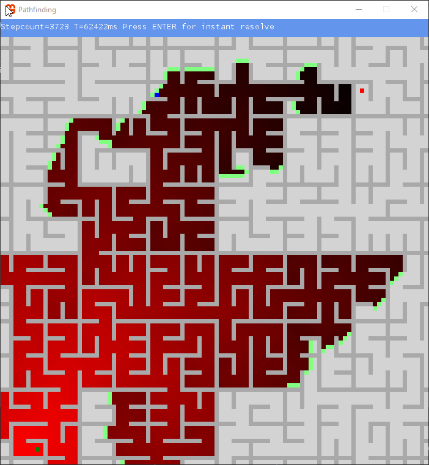

# PathfindingCSharp

Pathfinding visualization using C# MonoGame (XNA). A* and depth-first algorithms are implemented. Levels are supplied as BMP files, or can be drawn freehand.

---

*This is a hobby project made in 2014 and is not under active development.*
